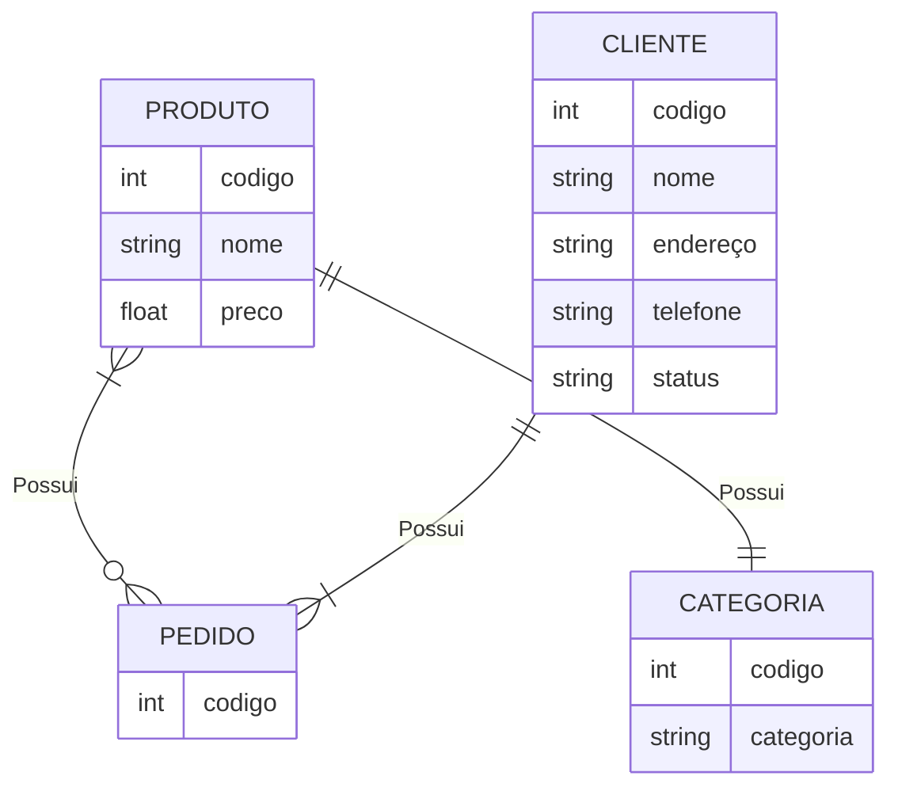

# Exercício 2

1 - Letra C

2 - Letra A

3 - Letra A

4 - Falso

5 - Letra D

6 - Letra A (ela se torna uma relação parcial caso exista a possibilidade de instâncias que não se relacionem)

7 - Letra C

8 - Letra C

9 - Letra D (Falso, ela é útil quando queremos substituir relacionamentos ternários ou relacionar 2 relacionamentos)

10 - Falso (É o contrário)

11 - 

