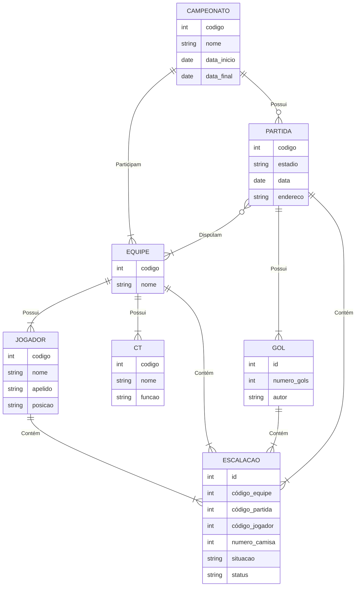
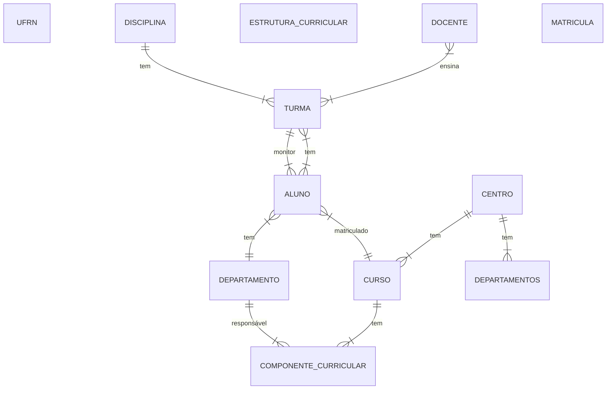
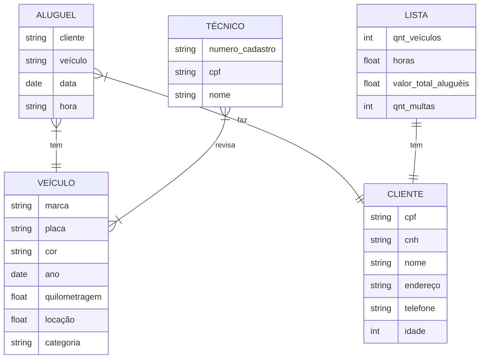
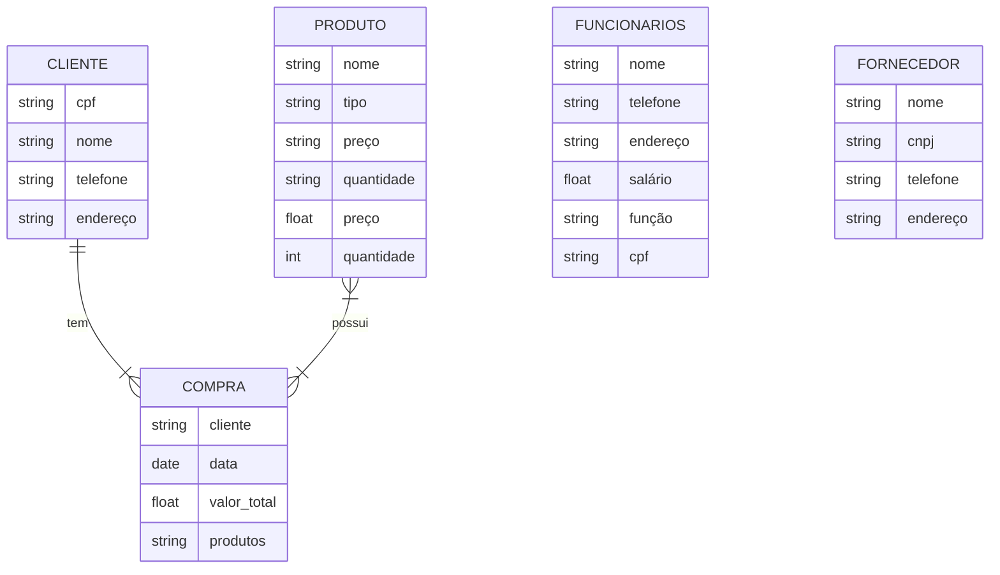
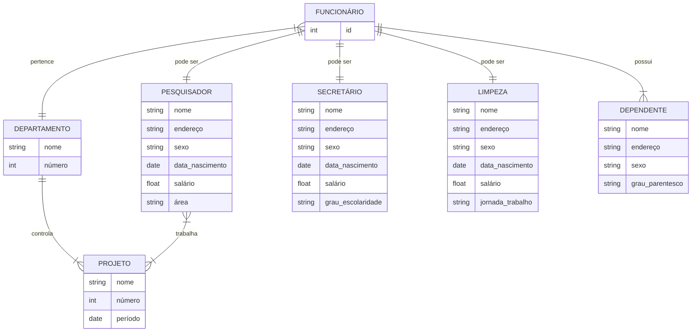

## Questão 1
SGBD ou sistema de gerenciamento de banco de dados é um software utilizado para gerir e armazenar base de dados de uma forma mais
organizada. Algumas das vantagens dos SGBDs em relação a um sistema de arquivo padrão são: atomicidade, operações
atômicas são mais difíceis de se executar em um sistema padrão de arquivo; Questões de segurança, os SGBD previnem acessos indevidos
ao banco de dados; previne criação de dados repetidos e padronizam o tipo do arquivo que guarda a base de dados.

## Questão 2

## Questão 3

## Questão 4

## Questão 5

## Questão 6

